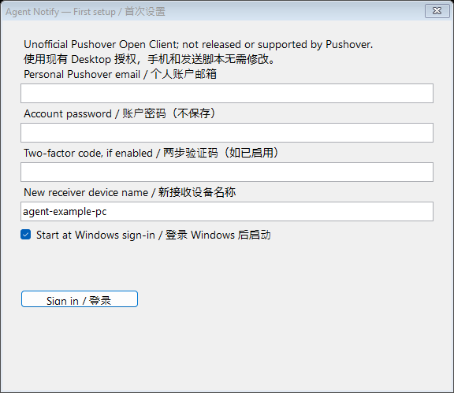

# Agent Notify

[中文说明](README.zh-CN.md) · [Install](docs/installation.md) · [Pushover setup](docs/pushover-setup.md) · [Agent integration](docs/agent-integration.md)

A small Windows tray app that brings personal task notifications to native Windows banners and Notification Center, while the same Pushover message reaches your phone. Keep your browser closed and your other app or game in front; return to the originating task when a decision needs your attention.

Agent Notify is an **unofficial Pushover Open Client**, not released, endorsed or supported by Pushover. This is an early, AI-assisted open-source application under the [MIT license](LICENSE). It uses your own Pushover account; no shared account or hosted relay is supplied.



## What it does

- Native Windows notification banners, sound, Notification Center and a tray inbox.
- Dedicated receiver device, optional start at Windows sign-in, one-instance behavior and reconnect backoff.
- Unicode text, durable local storage, exact message IDs and retry deduplication.
- High Windows toast priority requested for `Action needed:` messages; explicit acknowledgement for incoming emergency messages.
- Optional PowerShell sender for completion, actionable failure and decision requests from agents/scripts.
- Local account-session and sender-key encryption using Windows DPAPI. Passwords are not saved.

The receiver needs Windows and an internet connection. Phone delivery uses the official Pushover mobile app. Notifications prompt you to return to the task; they do not approve agent actions or provide a chat/reply bridge.

## Quick start

1. Register your own [Pushover account](https://pushover.net/signup) and install the [Android](https://pushover.net/clients/android) or [iOS](https://pushover.net/clients/ios) client if you want phone alerts.
2. Download the Windows ZIP from [Releases](https://github.com/kunpengyuky2449/agent-notify/releases), extract it, and double-click `Install.cmd` as your normal Windows user. Alternatively, [build from source](docs/installation.md#build-from-source).
3. Open **Agent Notify** from Start. Sign in locally with your Pushover account email/password and optional two-factor code. Keep the generated device name, or choose a unique name. Choose whether to start at Windows sign-in.
4. Enable its Windows banners/sounds. For gaming, add **Agent Notify** to **Settings → System → Notifications → Set priority notifications → Add apps**. Test in your actual game/display mode.
5. To send notifications yourself, [create your Pushover application and configure the sender](docs/pushover-setup.md#configure-the-sender). Receiver login and sending credentials are separate.

Requirements: Windows x64, .NET Framework 4.8, and Windows PowerShell 5.1 for installation. Windows 11 has been exercised interactively. Windows 10 is a target but has not been separately verified. No administrator account, Node.js, Python or Codex is needed to run the app. Source builds use Windows' existing compiler/metadata; some stripped-down Windows images may lack these files.

## Pushover cost

Agent Notify is free software. Pushover currently charges individuals **US$4.99 once per receiving platform**, with a **30-day trial**. Android plus Desktop is **US$9.98**, before taxes. Open Clients use the Desktop license; this app adds no separate receiver fee. Check [official pricing](https://pushover.net/pricing) and [Open Client licensing](https://pushover.net/api/client) before purchase. Pricing last checked: 2026-10-05.

## Send a task notification

After running `scripts/setup-pushover.cmd`, use the installed or checked-out sender:

```powershell
& .\scripts\notify.ps1 -Mode Send -Project example -Task export `
  -Event action-required -EventId export-run-001-review `
  -Message 'Export is ready. Return to the project chat to review it.'
```

Keep the same EventId when retrying the same event. `queued` means the service accepted it; check devices to establish display. The local sender caps attempts at ten per hour and suppresses duplicate/uncertain events. Suppressed messages are not scheduled for later.

## Reliability and limits

Windows Do Not Disturb, automatic gaming/full-screen rules and rendering mode can suppress banners. High toast priority is not a universal override. User-confirmed desktop and game banners, sound and Android receipt were achieved on the original Windows 11 machine; this is not a promise for every game or PC. See [troubleshooting](docs/troubleshooting.md) for the verification sequence.

Ordinary startup backlog is stored without a popup flood. The latest 200 ordinary messages are retained, plus pending alerts and unacknowledged emergencies. Local inbox text is private by filesystem permissions, but is not encrypted. Custom sounds, HTML rendering, attachments and mobile end-to-end-encrypted message compatibility are outside v0.1.0. Computer sleep/offline/exit stops immediate desktop reception; the phone is independent. The default sender uses normal Pushover priority and respects phone quiet hours.

## Development

```powershell
.\scripts\test.ps1
.\scripts\package.ps1
```

Offline checks use dummy credentials and mocked HTTP, covering storage, encryption, protocol handling, error recovery, deduplication, sender limits and priorities. They do not establish live service delivery. Windows CI builds/tests and produces a ZIP; live banners, device login and gaming are manual checks. Read [architecture](docs/architecture.md), [contributing](CONTRIBUTING.md), [security](SECURITY.md) and [release procedure](docs/releasing.md).

## Help and project scope

Use [GitHub issues](https://github.com/kunpengyuky2449/agent-notify/issues) for reproducible bugs and feature requests. If you cannot access GitHub or need installation guidance, contact **neclab369b@gmail.com**. Include Windows/app version and the failing step; omit passwords, keys, session files and private message text.

Pushover is a separate service. Its trademark, account rules, licenses and API remain governed by Pushover. See [the official site](https://pushover.net/) and [distribution guidelines](https://pushover.net/api/client#distribution).
