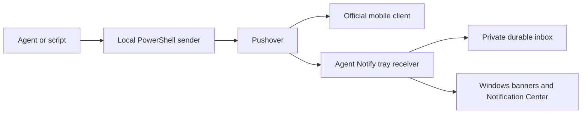

# Architecture and storage

The receiver is a C# 5 WinForms executable for .NET Framework 4.8, compiled with local Windows references. It talks directly to the official Open Client endpoints using HTTPS and a WebSocket. No company chat, browser runtime, embedded web UI, hosted relay or Windows service is required.

The source is `src/AgentNotify`: `Engine.cs` owns protocol/storage/sync; `WindowsIntegration.cs` owns Windows identity, native toasts and startup; `Program.cs` owns UI/tray; `SelfTests.cs` supplies offline checks; `AssemblyInfo.cs` supplies executable identity/version metadata. The sender and its mocked tests are PowerShell.

## Windows integration

The app sets `Personal.AgentNotify` as its AppUserModelID. Its own Start Menu shortcut carries that ID and a protocol-only stub CLSID. Toasts use `personalagentnotify:inbox`; clicking opens the existing receiver's inbox or starts the receiver. A per-user protocol key points to the installed executable. This uses the established desktop WinRT path, not the newer Windows App SDK. There is no COM activation server, toast text-input handler or game injection.

Each Windows user gets one local receiver instance. Startup is an optional `HKCU` Run value named `PersonalAgentNotify`. The installer creates the shortcut immediately using `--register-only`; login is a separate interactive action. Application notification priority requests do not rewrite Windows' global or per-app notification preferences.

## Data locations

| Data | Fresh-install location |
| --- | --- |
| Receiver session and inbox | `%LOCALAPPDATA%/AgentNotify/receiver` |
| Sender keys and content-free event ledger | `%LOCALAPPDATA%/AgentNotify/sender` |
| Program, docs and sender scripts | `%LOCALAPPDATA%/Programs/AgentNotify` |

For users upgrading the original prototype, the receiver continues to use `%LOCALAPPDATA%/AgentToolkit/agent-notify` when that existing session is present and the new location has no session. Likewise, the sender reuses `%LOCALAPPDATA%/AgentToolkit/pushover` when its existing configuration is present. This avoids moving or exposing working credentials; new users have no Toolkit dependency.

Current-user Windows DPAPI protects the stored receiving session and sending keys. Directory permissions restrict access to that Windows user and SYSTEM. Passwords are not saved. Inbox text is stored unencrypted inside the private directory. The send ledger contains event hashes, timestamps and outcomes rather than message bodies. Uninstall does not remove user data.

## Recovery behavior

Messages are stored atomically and processed before acknowledging deletion of this receiver's queue. Other devices' queues are unaffected. A notification failure retains a pending record; a later queue-delete failure does not re-alert already processed ordinary messages. IDs remain exact 64-bit integers. Unacknowledged emergencies survive history trimming and reopen on restart; acknowledging a notification has no relationship to permission for a task.

Startup imports ordinary backlog without a flood of banners. A second sync after socket subscription closes the initial download/subscription race. Temporary disconnects back off from five seconds to five minutes. Permanent authorization/concurrent-session errors stop automatic reconnect. Login/registration timeout results require account inspection before retrying; raw secret-bearing request URLs are not logged.

## Boundaries

No end-to-end encryption claim is made; message summaries travel through Pushover and inbox text persists locally. This first version is text-focused. Modern notifications/API migration, code signing, richer receiver preferences and a user-approved agent relay are possible future work, not present capabilities.
